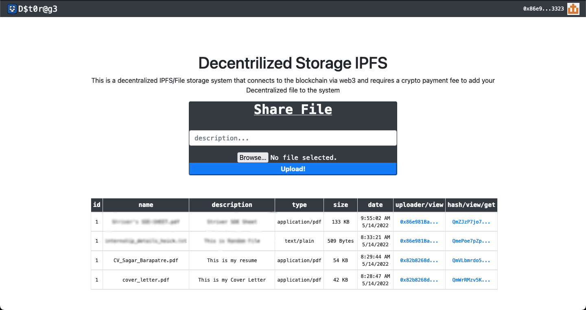

  

##  ``` Decentralized File Storage IPFS```


  

> “IPFS and the Blockchain are a perfect match! You can address large amounts of data with IPFS, and place the immutable, permanent IPFS links into a blockchain transaction. This timestamps and secures your content, without having to put the data on the chain itself.”

A simple DApp to upload a document to IPFS and then store the IPFS hash on the Ethereum blockchain. Once the IPFS hash number is sent to the Ethereum blockchain, the user will receive a transaction hash. We will use Create-React-App framework to make a front-end. This Dapp works with any user that has MetaMask installed in their browser.  
  

# Local Setup
>  **Pre-Requisites**
> React
> Ganache
> MetaMask
> Truffle

>

1. Fork this repository.

2. Clone the repository

```sh
git clone https://github.com/sagar-barapatre/Decentralize-Storage-IPFS.git
```

3. Open the folder in which you cloned the repository.
4. Open Ganache to run your local blockchain.

5. Run this command to build your smart contracts.

```sh
truffle init
truffle compile
truffle migrate
```

6. Run on your local host and connect your wallet with metamask to perfrom the transactions.

7. To start your application run the following command in your terminal.

```sh
npm start
```

  
  
  

<!--

https://itnext.io/build-a-simple-ethereum-interplanetary-file-system-ipfs-react-js-dapp-23ff4914ce4e

-->
